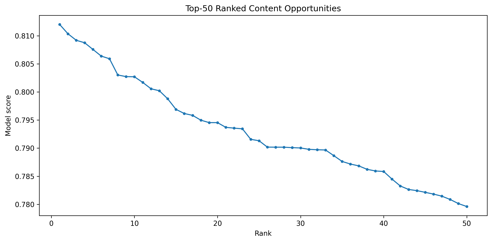
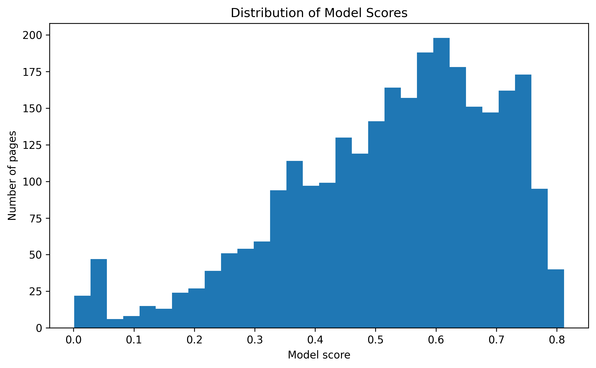
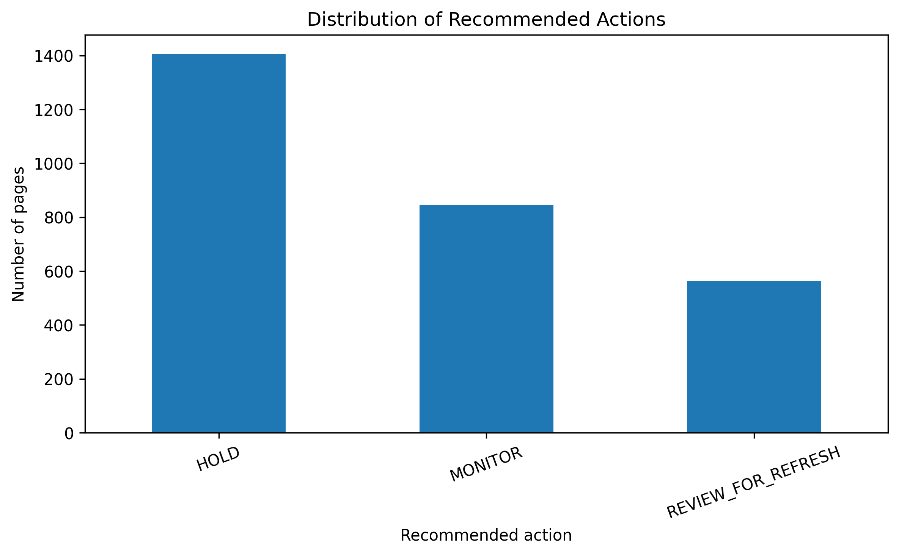

# Capstone Report — Content Refresh Opportunity Prioritization Using Machine Learning

- **Author:** **Anshika Agarwal**
- **Lane:** **Refresh / Content Opportunity Scoring**
- **Repo:** **https://github.com/Anshikaag-28/Anshika-FlyRank-ML**
- **Date:** **August 2026**

## 0. Abstract

This study investigates whether a machine-learning ranking model can help prioritize content pages associated with an observed decline signal for human content review. The analysis uses an anonymized content-refresh dataset containing 22,301 page-level observations available for validation and seven measurable features covering search performance, content age, and engagement signals. A Random Forest classifier is trained using a client-grouped holdout with 25 training clients and 7 test clients, with zero client overlap, and is compared with the Week-4 baseline using Precision@50. On the evaluated holdout, the Random Forest achieved a Precision@50 of 0.84 compared with 0.70 for the baseline, providing directional evidence that combining multiple page-level signals can improve prioritization of pages matching the observed decline proxy. The resulting ranked action queue is intended to support human editorial review by identifying which pages should receive attention first, rather than automatically determining that a page requires a refresh or that a refresh will improve performance.

## 1. Problem framing

The operational question is not "which page will definitely decline?" It is "which pages should an editor look at first for a possible content refresh?"

Content teams can have many pages to review, but limited editorial time and resources. Reviewing every page equally makes it difficult to identify which pages should receive attention first.

This project asks whether observable search-performance, content-age, and engagement signals can be combined to rank content pages associated with an observed decline signal. The decision supported by the analysis is therefore which pages an editor should review first, rather than whether a page should automatically be refreshed.

The unit of analysis is an individual content-page observation. The output is a machine-learning score and ranked action queue, with higher-scoring pages receiving higher review priority. A human editor or content analyst can use this ranking to focus attention on higher-priority pages while still checking search intent, content quality, seasonality, business context, and other factors before taking action.

The cost of a wrong call works in both directions: prioritizing a low-value page can waste limited editorial resources, while failing to prioritize a useful opportunity can delay potential content improvements. Machine learning helps by combining 7 observable page-level signals into a consistent ranking score rather than relying on a single performance metric.

Decision supported
Prioritize editorial attention and review — not automate the editorial decision.

## 2. Data safety

## 2. Data safety

### Data

The model works with observable search-performance, engagement, content-age, and content-related signals.

The analysis uses the anonymized FlyRank content-refresh dataset provided for the internship capstone: `data/raw/content_refresh_anonymized.csv`. The supplied file contains 30,000 content items and 44 columns. 

The analysis contains **22,301 page-level observations available for validation**. The dataset provides measurable signals related to search performance, content characteristics, and engagement.

### Final model features

`impressions_90d`

Observed search impressions over the 90-day window.

`sessions_90d`

Observed sessions over the 90-day window.

`content_age_days`

Age of the content item in days.

`ctr`

Observed click-through rate.

`avg_position`

Average observed search position.

`word_count`

Observed content length measured by word count.

`engagement_rate`

Observed engagement rate for the content item.

**Excluded fields**

Label-derived trend fields and pseudonymous identifiers were deliberately excluded from predictive features.

**Leakage control**

`trend_direction` and `trend_pct` are excluded because `trend_direction` is used to derive the target label. Including these fields as model features would leak information about the observed decline signal into the model.

`client_id` is retained only for client-grouped train/test splitting and leakage checks. It is **never used as a predictive feature**.

`content_id` is retained only to identify observations in the ranked output and is not used as a predictive feature.

**Public-safety note**

The analysis does not use client names, domains, page URLs, private search queries, credentials, or other client-identifying information. The work is designed to use anonymized and public-safe information only, with pseudonymous identifiers restricted to grouping or output identification rather than prediction.

## 3. Baseline

## 3. Baseline

The transparent rule or score you built first. Why it's a fair comparison, and its numbers on the same data and metric as your model.

### Baseline

The baseline is a transparent **CTR-position opportunity score** developed in Week 4. It prioritizes pages with meaningful search exposure whose observed CTR is below the typical CTR for pages in a similar average-position bucket.

Pages are first divided into four position buckets using `avg_position`: **Top 3 (0–3), Page 1 (3–10), Page 2 (10–20), and Deep (>20)**. For each bucket, the expected CTR is calculated as the **median CTR of the training pages in that bucket**.

The CTR opportunity is calculated as:

$$
\text{CTR Gap} = \text{Expected CTR} - \text{Observed CTR}
$$

Only positive opportunities contribute to the score:

$$
\text{Positive CTR Gap} = \max(\text{CTR Gap},0)
$$

The final baseline score is:

$$
\boxed{
\text{Baseline Score}
=
\max(\text{Expected CTR}-\text{CTR},0)
\times
\log(1+\text{impressions}_{90d})
}
$$

Pages are then ranked in descending order of the baseline score. The `log(1 + impressions_90d)` term gives greater weight to pages with meaningful search exposure while reducing the influence of extremely large impression values.

### Why this is a fair comparison

The baseline provides a transparent, rule-based benchmark against which the Random Forest can be compared. It does not use a trained machine-learning model and instead relies on a simple combination of **position-adjusted CTR opportunity and search exposure**.

For a fair comparison, the baseline and Random Forest are evaluated on the **same client-grouped held-out test set** and using the same evaluation metric, **Precision@50**. The expected CTR values used by the baseline are calculated from the training data only, preventing information from the held-out test clients from influencing the baseline.

### Baseline result

On the evaluated client-grouped test split, the Week-4 baseline achieved a **Precision@50 of 0.70**. This means that **35 of the top 50 baseline-ranked pages matched the observed decline proxy**.

The Random Forest achieved a **Precision@50 of 0.84** on the same held-out test set, with **42 of the top 50 ranked pages matching the observed decline proxy**.

The baseline therefore serves as a transparent reference point for measuring whether the multi-feature Random Forest provides stronger prioritization than the original rule-based approach.

## 4. Model / analysis

The method used for this analysis is a **Random Forest classifier**, selected for **Lane 2: Refresh / Content Opportunity Scoring**. The objective is to combine multiple observable page-level signals into a ranking score that can help prioritize content pages for human review.

A Random Forest fits this lane because the available signals can interact in non-linear ways. For example, impressions, sessions, CTR, average position, content age, word count, and engagement may provide different information about whether a page is associated with the observed decline proxy. The model can combine these signals into a probability score without requiring a manually specified linear relationship between them.

### Target / proxy definition

The target is **`is_declining_label = 1` when `trend_direction` is `"down"`, and `0` otherwise**, representing an observed decline state in the available dataset rather than a guaranteed future decline.

### Final model features

The Random Forest uses the following **7 observable features**:

* `impressions_90d`
* `sessions_90d`
* `content_age_days`
* `ctr`
* `avg_position`
* `word_count`
* `engagement_rate`

These features represent observable search-performance, content, age, and engagement signals available for the ranking analysis.

### Features deliberately left out

`trend_direction` and `trend_pct` are deliberately excluded because they are label-derived trend fields. `trend_direction` is used to construct the target, and including either field as a predictive feature would create leakage.

`is_declining_label` is excluded because it is the target itself.

`client_id` is used only for client-grouped validation and is never used as a predictive feature. `content_id` is used only to identify observations in the ranked output.

Other decision or outcome-related fields such as `priority_score`, `action_type`, and `health_score` are also excluded from the model features.

### Validation and training

The model is evaluated using a **client-grouped train/test split**, ensuring that the same client does not appear in both training and test data. The validation audit confirmed **25 training clients and 7 test clients**, with **zero client overlap**.

Missing numeric values are filled using medians calculated from the training data only. The model then ranks held-out pages using the predicted probability of the positive observed-decline proxy.

The Random Forest configuration uses:

* `n_estimators = 200`
* `max_depth = 12`
* `min_samples_leaf = 5`
* `class_weight = "balanced"`
* `random_state = 42`

### Baseline comparison result

The Random Forest is compared with the transparent Week-4 **CTR-position opportunity baseline** on the **same client-grouped held-out test set** using the same evaluation metric, **Precision@50**.

The baseline achieved:

**Precision@50 = 0.70**

The Random Forest achieved:

**Precision@50 = 0.84**

This corresponds to **35 of the top 50 pages** matching the observed decline proxy for the baseline, compared with **42 of the top 50 pages** for the Random Forest.

The improvement from **0.70 to 0.84** is therefore an observed improvement of **0.14 Precision@50**, or 7 additional matching pages within the top-50 review queue on this held-out split.

This result provides evidence that, on this particular client-grouped evaluation, combining the seven observable signals produced a stronger ranking of pages matching the observed decline proxy than the transparent rule-based baseline. It does **not** prove that the model will perform identically for every client, predict future decline with certainty, or establish that refreshing a highly ranked page will improve its future performance.

### Intended use

The model is intended as a **decision-support ranking system**, not an automated refresh decision. Its purpose is to help an editor or content analyst decide **where to look first** when reviewing a large number of pages.

## 5. Evaluation

### Evaluation split

The evaluation uses a **client-grouped train/test split** because pages from the same client can share patterns. Keeping all observations from a client in the same split reduces the risk that the model learns client-specific patterns that would make the test set artificially easy.

The available validation data contains **22,301 page-level observations**. The split contains **25 clients in the training set and 7 clients in the held-out test set**, with **zero client overlap** between the two groups.

The split uses `random_state = 42` to make the evaluation reproducible. The held-out test clients are not used for model training or for calculating the training-based preprocessing statistics.

### Evaluation metric

The primary metric is **Precision@50**, because the intended use is a ranked review queue where an editor may only have capacity to examine a limited number of pages.

Precision@50 measures the proportion of the top 50 ranked pages that match the observed decline proxy:

$$
\text{Precision@50}
=
\frac{\text{Number of positive pages in top 50}}{50}
$$

A higher Precision@50 means that more of the pages placed at the top of the review queue match the observed decline signal.

### Model versus baseline

Both the Random Forest and the Week-4 baseline are evaluated on the **same held-out test clients** and using the same Precision@50 metric.

| Method          | Precision@50 | Positive pages in top 50 |
| --------------- | -----------: | -----------------------: |
| Week-4 baseline |     **0.70** |              **35 / 50** |
| Random Forest   |     **0.84** |              **42 / 50** |

The Random Forest therefore shows an **absolute improvement of 0.14 Precision@50** over the baseline, corresponding to **7 additional matching pages among the top 50** on this held-out evaluation.

This is an observed improvement on the specific client-grouped test split, rather than a claim that the model will achieve the same performance on every future dataset or client.

### Error analysis

The remaining pages in the top-50 model ranking that do not match the observed decline proxy represent **false positives**. These pages would receive high review priority even though they are not labeled as declining in the evaluation data. Such cases are important because they may consume editorial review capacity.

**False negatives** are declining-proxy pages that receive lower model scores and therefore do not appear near the top of the review queue. These cases represent missed opportunities for prioritization.

The error analysis therefore highlights the trade-off inherent in a review-ranking system: improving Precision@50 reduces the number of non-matching pages in the highest-priority queue, but it does not eliminate missed declining pages.

The model's feature-importance analysis is used to inspect which observable signals contributed most to the Random Forest's decisions. These importances are interpreted as **model behavior rather than causal effects**. A feature receiving high importance does not mean that changing that feature will cause a page to recover.

### Evaluation conclusion

On the held-out client-grouped test set, the Random Forest achieved **0.84 Precision@50 compared with 0.70 for the transparent baseline**. This provides directional evidence that combining multiple observable page-level signals can improve prioritization of pages matching the observed decline proxy.

The evaluation does not establish that the model predicts guaranteed future decline or that refreshing a highly ranked page will improve its performance. Its appropriate role is therefore **decision support for prioritizing human editorial review**.

## 6. Interpretation

### What the model found

The Random Forest indicates that the observed decline proxy is associated with a **combination of page-level search, content, and engagement signals**, rather than a single measurable factor. This supports the use of a multi-feature ranking model instead of relying only on the CTR-position opportunity used by the baseline.

The model considers seven observable features: `impressions_90d`, `sessions_90d`, `content_age_days`, `ctr`, `avg_position`, `word_count`, and `engagement_rate`. Their feature importances provide an interpretation of which signals the model relied on when separating pages associated with the observed decline proxy.

Feature importance should be interpreted as **model reliance, not causation**. For example, if `ctr` or `avg_position` has high importance, this does not mean that changing CTR or search position will cause a page to decline or recover. These variables may also reflect other underlying characteristics of the page or its search environment.

### Relationship to the baseline

One useful finding is that the Random Forest performs better than the transparent CTR-position baseline on the held-out client-grouped split. The baseline focuses primarily on whether observed CTR is below the typical CTR for a page's position bucket, while the Random Forest can consider CTR together with impressions, sessions, content age, content length, position, and engagement.

The improvement from **0.70 to 0.84 Precision@50** suggests that the additional observable signals contain useful information for ranking pages that match the observed decline proxy. This does not mean that every individual feature is independently predictive or that all seven features are equally important.

### Error patterns and surprises

The model still produces both false positives and false negatives. Some pages receive high model scores without matching the decline proxy, while some pages associated with the proxy receive lower scores and are therefore not prioritized near the top of the queue.

This is an important result rather than simply a model failure: **the ranking signal is useful but imperfect**. A high model score should therefore trigger editorial investigation rather than automatically trigger a refresh.

Another important limitation is that the target represents an **observed decline state derived from `trend_direction`**, not a measured causal outcome of refreshing content. The analysis cannot determine whether a recommended refresh would subsequently improve traffic, CTR, rankings, or engagement.

### Negative results / what the model does not show

The analysis does not establish that:

* any individual feature causes content decline;
* a page with a high score is guaranteed to decline;
* refreshing a highly ranked page will improve its performance;
* the model will perform identically for unseen clients outside this evaluation;
* the model has learned or predicted Google's ranking algorithm.

Therefore, the main interpretation is **decision-support oriented**: the Random Forest provides a stronger observed ranking signal than the Week-4 baseline on the evaluated held-out clients, but editorial judgment remains necessary to determine whether a page is genuinely worth refreshing.

## 7. Recommendation

### Ranked editorial actions

The model output is designed to support a practical editorial review workflow. Rather than automatically deciding which pages require a refresh, the Random Forest produces a ranked score that helps editors prioritize which content-page observations should be reviewed first.

The highest-ranked pages receive the greatest review priority. An editor can then examine the page's search exposure, sessions, CTR, average position, content age, word count, engagement, and other contextual information before deciding whether an editorial action is appropriate.

### Ranked review queue

The Random Forest produces a ranked review queue based on the model score. The top 50 observations have model scores ranging from approximately 0.780 to 0.812, providing a clear ordering of higher-priority observations.

**Figure 1.** Top-50 ranked content opportunities based on Random Forest model scores.

The ranking is intended to determine **review priority**, not to guarantee that a page requires a refresh. Higher-ranked pages should therefore be investigated first, while still being evaluated using editorial judgment and additional context.

### Model score distribution

The model generates a continuous score across the evaluated observations rather than a simple yes/no decision.

**Figure 2.** Distribution of Random Forest model scores across evaluated page observations.

This continuous score allows the editorial team to prioritize limited review capacity. The score should be interpreted as a ranking signal associated with the observed decline proxy, rather than as a guaranteed probability that a page will decline or that a refresh will succeed.

### Action playbook

The ranked output is converted into three recommended actions:

1. **REVIEW_FOR_REFRESH** — prioritize the page for human review and investigate whether a content refresh is justified.
2. **MONITOR** — continue observing the page and consider additional evidence before taking action.
3. **HOLD** — do not prioritize the page for immediate editorial intervention based on the model output alone.

Across the 2,812 evaluated page observations, **1,406 pages (50.0%)** were assigned `HOLD`, **844 pages (30.0%)** were assigned `MONITOR`, and **562 pages (20.0%)** were assigned `REVIEW_FOR_REFRESH`.

**Figure 3.** Distribution of recommended editorial actions across the evaluated page observations.

The action distribution provides a practical way to allocate editorial attention: the `REVIEW_FOR_REFRESH` group can receive the highest immediate attention, while `MONITOR` and `HOLD` groups require progressively less immediate intervention.

### How an editor could use the output

A FlyRank editor could use the queue in the following workflow:

**1. Start with the highest-ranked pages.**  
Review pages with the strongest model scores first.

**2. Inspect the reason code.**  
Use the reason code associated with the recommendation to understand why the observation entered the queue.

**3. Validate the editorial context.**  
Check search intent, content quality, current search conditions, seasonality, relevance, and other factors that are not fully represented by the seven model features.

**4. Decide the appropriate action.**  
The editor can decide whether the page should actually be refreshed, monitored, or left unchanged.

**5. Track the decision and outcome.**  
Future editorial outcomes can be used to assess whether the ranking is useful in practice.

### Confidence and limitations

The main evidence supporting this recommendation is the held-out client-grouped evaluation, where the Random Forest achieved a **Precision@50 of 0.84**, compared with **0.70 for the Week-4 baseline**. This indicates that the model provided a stronger ranking signal for pages matching the observed decline proxy on the evaluated holdout.

However, this result should be treated as **directional evidence rather than a guarantee of future performance**. The model can produce false positives and false negatives, and the observed decline proxy does not establish that a page will decline in the future.

Most importantly, the analysis does not show that refreshing a recommended page will cause its traffic, CTR, rankings, or engagement to improve. The model therefore supports **human-in-the-loop prioritization**, not automated editorial decisions.

## 8. Reproducibility

The complete analysis can be re-run from a fresh clone of the project repository. The repository contains the capstone notebook, anonymized dataset, model configuration, generated figures, and final ranked action-playbook output.

From a fresh clone, the analysis can be set up with:

    git clone https://github.com/Anshikaag-28/Anshika-FlyRank-ML.git
    cd Anshika-FlyRank-ML
    pip install pandas numpy scikit-learn matplotlib seaborn jupyter

The main analysis is contained in:

    work/notebooks/capstone.ipynb

The analysis uses the anonymized dataset:

    data/raw/content_refresh_anonymized.csv

The final ranked action queue is saved as:

    work/capstone_outputs/action_playbook_queue.csv

The generated figures are saved as:

    work/figures/top50_model_ranking.png
    work/figures/model_score_distribution.png
    work/figures/action_distribution.png

The client-grouped train/test split uses `random_state=42`. The final evaluation contains 25 training clients and 7 held-out test clients, with zero client overlap. The Random Forest uses `n_estimators=200`, `max_depth=12`, `min_samples_leaf=5`, `class_weight="balanced"`, `random_state=42`, and `n_jobs=-1`.

The seven predictive features are `impressions_90d`, `sessions_90d`, `content_age_days`, `ctr`, `avg_position`, `word_count`, and `engagement_rate`. Missing numeric values are handled using training-set medians only.

The Random Forest and Week-4 baseline are evaluated on the same held-out client-grouped test set using Precision@50. The Random Forest achieved a Precision@50 of `0.84`, while the baseline achieved `0.70`.

The client-grouped holdout is reproducible using the documented split procedure and fixed random seed. The project does not claim a permanently sealed or independently audited "evaluated once, blind" benchmark. The reported result should therefore be interpreted as evidence from the specified held-out client evaluation, and performance may change with different data snapshots, clients, features, or future evaluation periods.

## 9. Acknowledgments & data credit

This work was **Built on the [FlyRank ML Internship dataset](https://flyrank.ai)**. The dataset was used for educational and research-oriented analysis of content-refresh prioritization, with all reported results presented in an anonymized and public-safe form.

---

